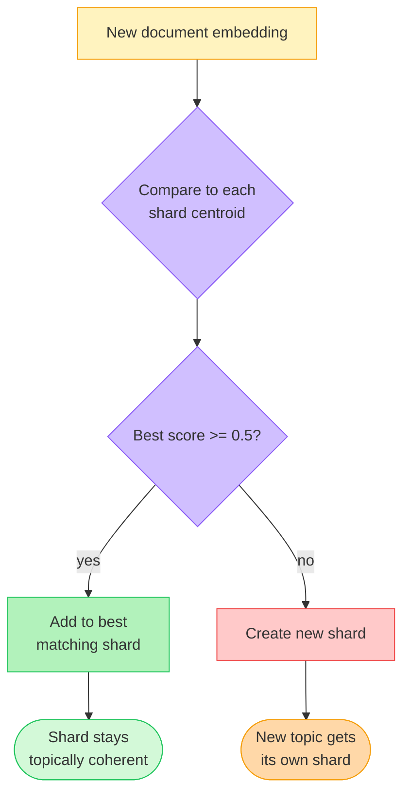
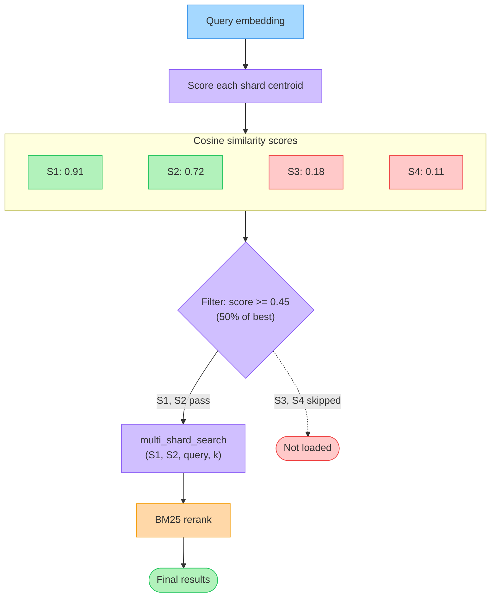

<div align="center">
  <h1>Voy</h1>
  <strong>A browser-first WASM vector search engine written in Rust</strong>
</div>

![voy: a vector similarity search engine in WebAssembly][demo]

- **Exact search**: dense vector search tuned for browser workloads.
- **Binary indexes**: compact serialized indexes via `Uint8Array`.
- **Runtime dimensions**: optimized for `384` dimensions and below, while still supporting larger vectors.
- **Worker-friendly**: designed to pair with local embedding generation in a Web Worker.

## API

### `class Voy`

```ts
type Metric = "euclidean" | "cosine";

interface VoyOptions {
  metric?: Metric;
}

interface EmbeddedResource {
  id: string;
  title: string;
  url: string;
  embeddings: number[];
}

interface Resource {
  embeddings: EmbeddedResource[];
}

interface SearchResult {
  neighbors: Array<{
    id: string;
    title: string;
    url: string;
    score: number;
  }>;
}

class Voy {
  constructor(resource?: Resource, options?: VoyOptions);
  index(resource: Resource, options?: VoyOptions): void;
  search(query: Float32Array | number[], k: number): SearchResult;
  add(resource: Resource): void;
  remove(resource: Resource): void;
  clear(): void;
  size(): number;
  serialize(): Uint8Array;
  static deserialize(serializedIndex: Uint8Array): Voy;
}
```

### Standalone functions

```ts
function index(resource: Resource, options?: VoyOptions): Uint8Array;
function search(index: Uint8Array, query: Float32Array | number[], k: number): SearchResult;
function add(index: Uint8Array, resource: Resource): Uint8Array;
function remove(index: Uint8Array, resource: Resource): Uint8Array;
function clear(index: Uint8Array): Uint8Array;
function size(index: Uint8Array): number;
```

## Usage

```ts
import init, { Voy } from "voy-search";

await init();

const resource = {
  embeddings: [
    {
      id: "doc-1",
      title: "Amazon rainforest overview",
      url: "/docs/amazon-overview",
      embeddings: [0.12, -0.03, 0.88],
    },
    {
      id: "doc-2",
      title: "Peru and Colombia",
      url: "/docs/peru-colombia",
      embeddings: [0.18, 0.41, 0.33],
    },
  ],
};

const voy = new Voy(resource, { metric: "cosine" });
const result = voy.search([0.11, -0.01, 0.87], 1);

console.log(result.neighbors[0].title);
console.log(result.neighbors[0].score);

const bytes = voy.serialize();
const restored = Voy.deserialize(bytes);
console.log(restored.size());
```

## Browser Demo

This repo now ships one maintained example in [examples/create-wasm-app](./examples/create-wasm-app):

- local embeddings in a Worker
- shard-managed browser retrieval on top of `Voy`
- OPFS-backed persistence so reloads do not re-embed
- BM25-style reranking on the vector candidate set
- add/remove/search corpus interactions
- static build suitable for GitHub Pages

### Run locally

```bash
wasm-pack build --target web --out-dir pkg
cd examples/create-wasm-app
npm ci
npm run dev
```

## FAQ

### How do shards work?

The Rust engine has no built-in concept of shards — a "shard" is simply an independently created and serialized `Index`. Your application decides how to partition documents across shards and how to manage their lifecycle.

The demo app in `examples/create-wasm-app` includes a `VoyShardManager` that implements similarity-based routing, centroid-based search pruning, and LRU caching.

#### Inserting documents — similarity-based routing

When a document is added, the manager compares its embedding to the **centroid** (average embedding) of every non-full shard. It routes the document to the shard with the highest cosine similarity, provided the score meets a configurable `similarityThreshold` (default 0.5). If no shard is similar enough, a new shard is created.

This causes documents about similar topics to cluster in the same shard, which makes each shard's centroid an accurate summary of its contents.



#### Searching — centroid-based pruning

At search time the manager scores every shard's centroid against the query embedding and only loads the top `maxShardsPerSearch` (default 3) shards whose centroid scores above 50% of the best score. Irrelevant shards are never loaded or searched.

The selected shard buffers are passed to `multi_shard_search`, which deserializes them, runs a brute-force search on each, and returns a globally merged top-k result. The manager then applies BM25 reranking on the merged results for the final ranking.



#### Storage and caching

Each shard is persisted as a `.vec` file (the `VOY1` binary format) in the browser's Origin Private File System (OPFS). Shards are loaded on demand and held in an LRU cache with a byte budget (default 32 MB). Least-recently-used shards are evicted when the budget is exceeded.

#### Configuration

| Option | Default | Description |
|---|---|---|
| `maxDocsPerShard` | 1000 | Documents per shard before sealing |
| `similarityThreshold` | 0.5 | Minimum cosine similarity to route to an existing shard |
| `maxShardsPerSearch` | 3 | Maximum shards loaded per search |
| `cacheByteBudget` | 32 MB | LRU cache size for loaded shards |

## Notes

- v1 uses a binary serialized index format. Serialized artifacts from older JSON-based releases are not supported.
- All embeddings in an index must have the same dimension.
- `cosine` normalizes vectors internally; `euclidean` preserves the raw values.

## License

Licensed under either of

- Apache License, Version 2.0, ([LICENSE_APACHE](LICENSE_APACHE) or http://www.apache.org/licenses/LICENSE-2.0)
- MIT license ([LICENSE_MIT](LICENSE_MIT) or http://opensource.org/licenses/MIT)

at your option.

[demo]: ./voy.gif "voy demo"
